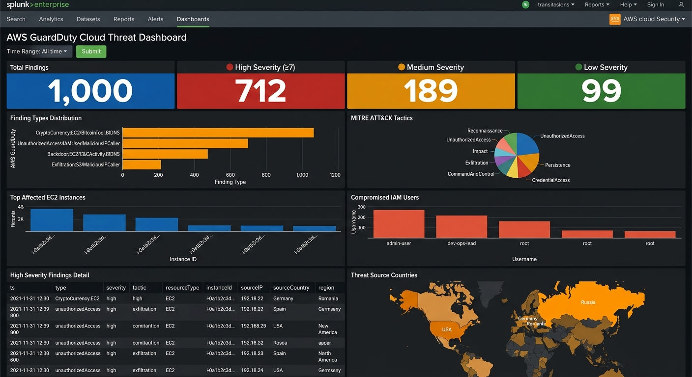

<div align="center">


</div>

> **Project Type:** Cloud Security — SIEM Integration & Threat Dashboard  
> **Platform:** AWS GuardDuty → Amazon S3 → Splunk Enterprise  
> **Data Source:** `guardduty_findings.json` (1,000 findings)  
> **Skill Level:** Intermediate → Advanced

## 📸 Completed Dashboard




## 📋 Overview

AWS GuardDuty detects threats in your cloud environment ☁️ — unauthorized API calls 🔑, cryptocurrency mining 💰, malicious IP communication 🌐, and data exfiltration 📤. But findings stuck in the AWS console aren't actionable.

**This project:** Exports GuardDuty findings to S3 ➡️ Ingests them into Splunk ➡️ Builds SPL queries for cloud threat detection ➡️ Creates SOC-ready dashboards 📊.


## 📋 Table of Contents

| #   | Section                                              | Status |
| --- | ---------------------------------------------------- | ------ |
| 0   | [Architecture & Tech Stack](#-architecture--tech-stack) | ⬜      |
| 1   | [Implementation Steps](#-implementation-steps)        | ⬜      |
| 2   | [Lab Setup — Data Ingestion](#lab-setup--data-ingestion) | ⬜      |
| 3   | [Task 1 — Cloud Threat Overview](#task-1--cloud-threat-overview) | ⬜      |
| 4   | [Task 2 — Threat Analysis & MITRE Mapping](#task-2--threat-analysis--mitre-mapping) | ⬜      |
| 5   | [Task 3 — Affected Resources](#task-3--affected-resources) | ⬜      |
| 6   | [Task 4 — High Severity Investigation & Geo-Location](#task-4--high-severity-investigation--geo-location) | ⬜      |
| 7   | [Final Dashboard Layout](#final-dashboard-layout)    | ⬜      |


## 🏗️ Architecture & Tech Stack

```
┌─────────────────┐       ┌──────────────┐       ┌──────────────┐       ┌─────────────────┐
│  AWS GuardDuty  │──────▶│  Amazon S3   │──────▶│  Amazon SQS  │──────▶│     Splunk      │
│  (Threat Detect)│       │  (Export)    │       │  (Notify)    │       │  (SIEM/Dashboard)│
└─────────────────┘       └──────────────┘       └──────────────┘       └─────────────────┘
      │                                                                        │
      ▼                                                                        ▼
 CloudTrail Logs                                                        SPL Queries
 VPC Flow Logs                                                          Alert Rules
 DNS Query Logs                                                         Dashboards
```

### 🛠️ Tech Stack

| Tool | Role |
|------|------|
| 🛡️ **AWS GuardDuty** | Cloud-native threat detection — analyzes CloudTrail, VPC Flow Logs, DNS |
| 📦 **Amazon S3** | Finding export storage bucket |
| 📬 **Amazon SQS** | Event notification for new finding objects |
| 🟢 **Splunk Enterprise** | SIEM for querying, analysis, and dashboard visualization |
| 🔌 **Splunk Add-on for AWS** | Automated S3 log ingestion into Splunk |


## 📝 Implementation Steps

> These steps document the **production architecture**. For the lab exercise below, we use pre-generated sample data to build the dashboard.

### 🔹 Step 1 — Enable AWS GuardDuty

1. Open **AWS Console** → **GuardDuty** → **Get Started**
2. Enable GuardDuty in your primary region
3. GuardDuty automatically analyzes:
   - ☁️ **CloudTrail** management events
   - 🌐 **VPC Flow Logs**
   - 🔍 **DNS query logs**

### 🔹 Step 2 — Generate Sample Findings

1. In GuardDuty console → **Settings** → **Generate Sample Findings**
2. This creates realistic test findings including:

| Finding Type | Severity | MITRE Tactic |
|---|---|---|
| `Recon:EC2/PortProbeUnprotectedPort` | Low (2) | Reconnaissance |
| `UnauthorizedAccess:IAMUser/MaliciousIPCaller` | High (8) | Unauthorized Access |
| `CryptoCurrency:EC2/BitcoinTool.B!DNS` | High (8) | Impact |
| `Exfiltration:S3/MaliciousIPCaller` | High (9) | Exfiltration |
| `Backdoor:EC2/C&CActivity.B!DNS` | High (9) | Command & Control |

### 🔹 Step 3 — Export Findings to S3

1. Create S3 bucket: `guardduty-findings-export`
2. Configure GuardDuty → **Settings** → **Findings Export Options**:
   - **S3 Bucket:** `guardduty-findings-export`
   - **Frequency:** Every 15 minutes
   - **KMS Key:** Use default or custom encryption
3. Set up SQS queue for new object notifications

### 🔹 Step 4 — Configure Splunk Add-on for AWS

1. Install **Splunk Add-on for AWS** from Splunkbase
2. Configure AWS credentials (IAM user with S3 + SQS read permissions):
   ```
   aws_access_key_id = AKIA...
   aws_secret_access_key = ...
   ```
3. Create input: **SQS-Based S3 Input** pointing to the GuardDuty bucket
4. Set index to `aws_guardduty`, sourcetype to `aws:cloudtrail:guardduty`

> ⚠️ **IAM Least-Privilege Policy:** Only grant `s3:GetObject`, `sqs:ReceiveMessage`, `sqs:DeleteMessage` permissions. Never use root credentials.

### 🔹 Step 5 — Configure Alerts

| Alert | Condition | Action |
|-------|-----------|--------|
| 🔴 Critical Finding | `severity >= 8` | Email SOC + Slack notification |
| 💰 Crypto Mining | `type="CryptoCurrency*"` | Isolate EC2 instance |
| 🔑 IAM Compromise | `type="UnauthorizedAccess:IAMUser*"` | Revoke IAM credentials |
| 📤 Data Exfiltration | `type="Exfiltration:S3*"` | Block S3 bucket access |


## Lab Setup & Data Ingestion

### What You Need

| Requirement            | Details                                                                 |
| ---------------------- | ----------------------------------------------------------------------- |
| **Splunk Instance**    | Splunk Enterprise (local) or Splunk Cloud (free trial works)            |
| **Data File**          | `guardduty_findings.json` → host `AWSGuardDuty` (1,000 findings)       |
| **Sourcetype**         | `_json` for JSON logs                                                   |
| **Key Fields**         | `type`, `severity`, `severityLabel`, `tactic`, `resourceType`, `sourceIP`, `sourceCountry` |

### Data Ingestion

1. **Upload `guardduty_findings.json`**
   - Settings → Add Data → Upload → select `guardduty_findings.json`
   - Set **Host** = `AWSGuardDuty`, **Sourcetype** = `_json`
   - Review & Submit

2. **Verify ingestion:**
   ```spl
   source="guardduty_findings.json" host="AWSGuardDuty" | head 10
   ```

### Create the Dashboard

1. Go to **Dashboards** → **Create New Dashboard**
2. Name it **AWS GuardDuty Cloud Threat Dashboard**
3. Select **Classic Dashboard** (Simple XML)
4. Choose **Absolute** layout → Click **Create**
5. Add **Time Range** input (token: `time_range`) + **Submit** button


##  Task 1 — Cloud Threat Overview

**Goal:** At-a-glance severity breakdown of all GuardDuty findings — total count plus HIGH/MEDIUM/LOW splits.

> 🎯 All four panels are **Single Value** visualizations.

---

### Panel 1.1 — Total Findings

**SPL Query:**

```spl
source="guardduty_findings.json" host="AWSGuardDuty" sourcetype="_json"
| stats count AS "Total Findings"
```

**What this does:** Baseline metric — total GuardDuty findings. In a production environment, this correlates directly with GuardDuty's billable analysis volume.

---

### Panel 1.2 — 🔴 High Severity (≥7)

**SPL Query:**

```spl
source="guardduty_findings.json" host="AWSGuardDuty" sourcetype="_json" severityLabel="HIGH"
| stats count AS "High Severity"
```

**What this does:** Counts all findings with severity ≥ 7. These require **immediate SOC response**:
- Credential compromise (IAM key exfiltration)
- Cryptocurrency mining on EC2 instances
- Active C2 communication
- S3 data exfiltration

> 🔍 **SOC Analyst Tip:** A single high-severity finding in production = immediate investigation. Multiple high-severity findings from the same resource = active compromise. Escalate to Incident Response immediately.

---

### Panel 1.3 — 🟡 Medium Severity

**SPL Query:**

```spl
source="guardduty_findings.json" host="AWSGuardDuty" sourcetype="_json" severityLabel="MEDIUM"
| stats count AS "Medium Severity"
```

**What this does:** Counts findings in the 4-6 severity range. These indicate suspicious activity worth investigating but not immediately critical — port scans, unusual DNS resolutions, discovery-phase tactics.

---

### Panel 1.4 — 🟢 Low Severity

**SPL Query:**

```spl
source="guardduty_findings.json" host="AWSGuardDuty" sourcetype="_json" severityLabel="LOW"
| stats count AS "Low Severity"
```

**What this does:** Counts informational findings (severity 1-3). These are reconnaissance indicators and baseline noise — port probes, routine scanning activity.

---

### ✅ Task 1 Result

| Total Findings | 🔴 High Severity | 🟡 Medium Severity | 🟢 Low Severity |
|----|----|----|-----|


##  Task 2 — Threat Analysis & MITRE Mapping

**Goal:** Understand the threat landscape — most common finding types and their mapping to MITRE ATT&CK tactics.

---

### Panel 2.1 — Finding Types Distribution (Bar Chart)

| Setting | Value |
|---------|-------|
| **Panel Type** | Bar Chart |
| **Content Title** | Finding Types Distribution |

**SPL Query:**

```spl
source="guardduty_findings.json" host="AWSGuardDuty" sourcetype="_json"
| top limit=10 type
```

**What this does:** Ranks the most common GuardDuty finding types. Key indicators:
- **`CryptoCurrency:EC2/BitcoinTool.B!DNS`** — EC2 instance mining crypto (compromised or intentional abuse)
- **`UnauthorizedAccess:IAMUser/MaliciousIPCaller`** — IAM credentials used from a known-malicious IP
- **`Backdoor:EC2/C&CActivity.B!DNS`** — EC2 instance communicating with command & control infrastructure
- **`Exfiltration:S3/MaliciousIPCaller`** — S3 bucket accessed from threat actor IP

> 🔍 **SOC Analyst Tip:** GuardDuty finding types follow the format `ThreatCategory:ResourceType/FindingName`. Learn to read this pattern — it tells you *what* happened to *which* resource type instantly.

---

### Panel 2.2 — MITRE ATT&CK Tactics (Pie Chart)

| Setting | Value |
|---------|-------|
| **Panel Type** | Pie Chart |
| **Content Title** | MITRE ATT&CK Tactics |

**SPL Query:**

```spl
source="guardduty_findings.json" host="AWSGuardDuty" sourcetype="_json"
| stats count by tactic
```

**What this does:** Maps all findings to MITRE ATT&CK Cloud tactics. This shows the attacker's **kill chain position**:

| Tactic | Risk Level | What It Means |
|--------|-----------|---------------|
| **Reconnaissance** | 🟡 | Attacker is probing your infrastructure |
| **InitialAccess** | 🟠 | Attacker has gained first foothold |
| **CredentialAccess** | 🔴 | Attacker is stealing credentials |
| **PrivilegeEscalation** | 🔴 | Attacker is elevating permissions |
| **Exfiltration** | 🔴 | Data is leaving your environment |
| **Impact** | 🔴 | Attacker is causing damage (crypto mining, destruction) |
| **CommandAndControl** | 🔴 | Persistent backdoor communication |

> ⚠️ **Production Enhancement:** In a real SOC, overlay these tactics on the MITRE ATT&CK for Cloud matrix to visualize coverage gaps.

---

### ✅ Task 2 Result

| Finding Types (Bar Chart) | MITRE ATT&CK Tactics (Pie Chart) |
|---|---|


##  Task 3 — Affected Resources

**Goal:** Identify the most targeted AWS resources — EC2 instances and IAM users — to prioritize remediation.

---

### Panel 3.1 — Top Affected EC2 Instances (Bar Chart)

**SPL Query:**

```spl
source="guardduty_findings.json" host="AWSGuardDuty" sourcetype="_json" resourceType="EC2"
| top limit=10 instanceId
```

**What this does:** Ranks EC2 instances by finding count. An instance appearing repeatedly across multiple finding types is almost certainly compromised.

> 🔍 **SOC Analyst Response for Compromised EC2:**
> 1. **Isolate** — Remove from security groups, attach quarantine SG (no inbound/outbound)
> 2. **Snapshot** — Create EBS snapshots for forensic analysis
> 3. **Memory Capture** — Use SSM to capture volatile memory before termination
> 4. **Investigate** — Check CloudTrail for how the instance was compromised
> 5. **Terminate & Rebuild** — Never "clean" a compromised instance, rebuild from AMI

---

### Panel 3.2 — Compromised IAM Users (Bar Chart)

**SPL Query:**

```spl
source="guardduty_findings.json" host="AWSGuardDuty" sourcetype="_json" resourceType="IAMUser"
| top limit=10 iamUser
```

**What this does:** Identifies IAM users whose credentials are associated with threat findings. Immediate response: rotate credentials and audit CloudTrail for unauthorized API calls.

> 🔍 **SOC Analyst Response for IAM Compromise:**
> 1. **Disable** access keys immediately (`aws iam update-access-key --status Inactive`)
> 2. **Revoke** all active sessions (`aws iam put-user-policy` with deny-all)
> 3. **Audit** — Review CloudTrail for all API calls made with those credentials
> 4. **Rotate** — Generate new access keys after investigation
> 5. **Enforce MFA** — Add hardware MFA requirement for the user

---

### ✅ Task 3 Result

| Affected EC2 Instances (Bar Chart) | Compromised IAM Users (Bar Chart) |
|---|---|


##  Task 4 — High Severity Investigation & Geo-Location

**Goal:** Detailed investigation table of critical findings plus geographic mapping of threat sources.

---

### Panel 4.1 — 🔴 High Severity Findings Detail (Statistics Table)

**SPL Query:**

```spl
source="guardduty_findings.json" host="AWSGuardDuty" sourcetype="_json" severityLabel="HIGH"
| table ts, type, severity, tactic, resourceType, instanceId, iamUser, sourceIP, sourceCountry, region
| sort -severity, -ts
```

**SPL Breakdown:**

| Line | Command | Purpose |
|------|---------|---------|
| 1 | `severityLabel="HIGH"` | Filter to high-severity findings only |
| 2 | `\| table ts, type, ...` | Display key fields as investigation columns |
| 3 | `\| sort -severity, -ts` | Sort by severity desc, then time desc — worst findings first |

**What this does:** This is the SOC analyst's **primary investigation queue**. Each row is a security event requiring analysis and response. The table shows:
- **When** it happened (`ts`)
- **What** happened (`type`, `tactic`)
- **Where** — which AWS resource (`instanceId`, `iamUser`, `region`)
- **Who** — the attacker's source (`sourceIP`, `sourceCountry`)

> 🔍 **Triage Priority Matrix:**
> | Severity + Tactic | Priority | Response |
> |---|---|---|
> | 9 + Exfiltration | 🔴 P1 — Critical | Immediate containment, data breach assessment |
> | 9 + C&C | 🔴 P1 — Critical | Network isolation, forensic capture |
> | 8 + CryptoCurrency | 🟠 P2 — High | Instance isolation, billing impact check |
> | 8 + UnauthorizedAccess | 🟠 P2 — High | Credential rotation, audit trail review |
> | 7 + Persistence | 🟡 P3 — Medium | Backdoor hunting, IAM policy audit |

---

### Panel 4.2 — Threat Source Countries (Choropleth Map)

**SPL Query:**

```spl
source="guardduty_findings.json" host="AWSGuardDuty" sourcetype="_json"
| table id.orig_h
| iplocation id.orig_h
| stats count by Country
| geom geo_countries featureIdField="Country"
```

**What this does:** World heatmap showing where threat actors are connecting from. Useful for:
- Identifying geographic patterns in attacks
- Recommending WAF geo-blocking rules
- Correlating with threat intelligence on APT group origins

---

### ✅ Task 4 Result

> Row 4: High severity investigation table. Row 5: Threat geo-location map.


## 🏁 Final Dashboard Layout

| Row | Panels | Visualization Type |
|-----|--------|-------------------|
| **Input Bar** | Time Range + Submit | Input controls |
| **Row 1** | Total Findings · 🔴 High Severity · 🟡 Medium · 🟢 Low | 4× Single Value |
| **Row 2** | Finding Types · MITRE ATT&CK Tactics | Bar Chart + Pie Chart |
| **Row 3** | Affected EC2 Instances · Compromised IAM Users | 2× Bar Chart |
| **Row 4** | High Severity Findings Detail | Statistics Table (full width) |
| **Row 5** | Threat Source Countries | Choropleth Map (full width) |

---

##  Complete Simple XML Reference

The full dashboard XML is available at [`xml/guardduty_dashboard.xml`](xml/guardduty_dashboard.xml). Import via:

1. **Dashboards** → **Create New Dashboard** → Name it → **Create**
2. Click **Edit** → **Source** → Paste XML → **Save** ✅


## 🔑 Key Takeaways for SOC Analysts

| Concept | What You Practiced |
|---------|-------------------|
| **Cloud Security** | AWS GuardDuty — understanding cloud-native threat detection |
| **Data Pipeline** | S3 → SQS → Splunk — cloud-to-SIEM ingestion architecture |
| **MITRE ATT&CK** | Mapping findings to Cloud ATT&CK tactics for kill chain analysis |
| **Incident Response** | EC2 isolation, IAM credential rotation, S3 access containment |
| **SPL Commands** | `stats count`, `top`, `table`, `iplocation`, `geom`, `where`, `sort` |
| **Alert Engineering** | Creating severity-based and finding-type-specific alert rules |

---

## 📂 Project Structure

```
splunk-soc-project/
├── AWS_GUARDDUTY_ANALYSIS.md          ← This file
├── data/
│   └── guardduty_findings.json        ← 1,000 GuardDuty findings
└── xml/
    └── guardduty_dashboard.xml         ← Importable Splunk XML
```


<div align="center">


</div>

<div align="center">

[](README.md)

</div>


