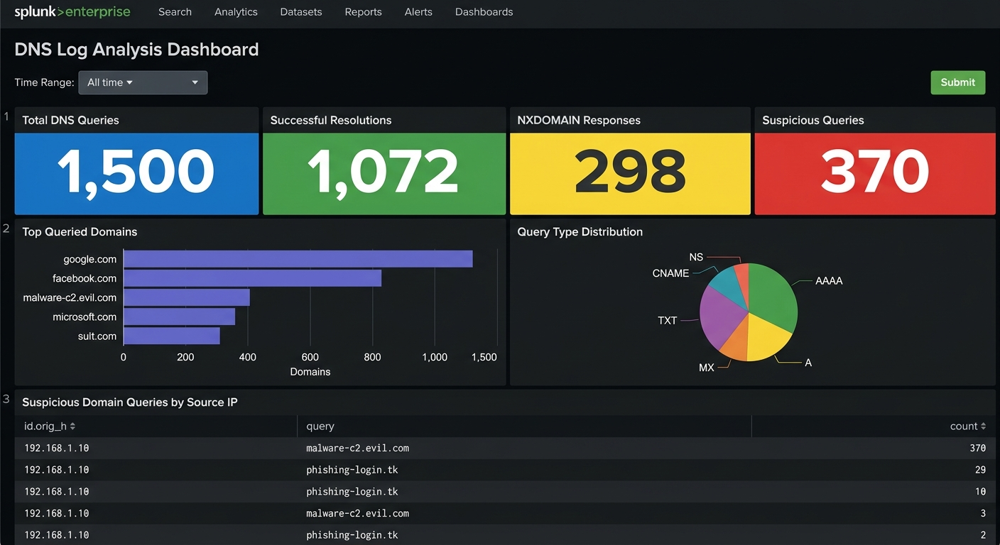

<div align="center">


</div>

> **Project Type:** SOC Analyst Lab — SIEM Dashboard Building  
> **Platform:** Splunk Enterprise / Splunk Cloud  
> **Data Source:** `dns_logs.json` (1,500 events)  
> **Skill Level:** Beginner → Intermediate

## 📸 Completed Dashboard




## 📋 Table of Contents

| #   | Section                                              | Status |
| --- | ---------------------------------------------------- | ------ |
| 0   | [Lab Setup & Prerequisites](#lab-setup--prerequisites) | ⬜      |
| 1   | [Task 0 — Time Range Input](#task-0--setting-up-time-range) | ⬜      |
| 2   | [Task 1 — DNS Overview Panels](#task-1--dns-overview-panels) | ⬜      |
| 3   | [Task 2 — DNS Activity Patterns](#task-2--dns-activity-patterns) | ⬜      |
| 4   | [Task 3 — Threat Detection](#task-3--threat-detection) | ⬜      |
| 5   | [Final Dashboard Layout](#final-dashboard-layout)    | ⬜      |


## Lab Setup & Prerequisites

### What You Need

| Requirement            | Details                                                                 |
| ---------------------- | ----------------------------------------------------------------------- |
| **Splunk Instance**    | Splunk Enterprise (local) or Splunk Cloud (free trial works)            |
| **Data File**          | `dns_logs.json` → host `DNSServer` (1,500 DNS query events)            |
| **Sourcetype**         | `_json` for JSON logs                                                   |
| **Key Fields**         | `query`, `qtype_name`, `rcode_name`, `id.orig_h`, `classification`     |

### Data Ingestion

1. **Upload `dns_logs.json`**
   - Settings → Add Data → Upload → select `dns_logs.json`
   - Set **Host** = `DNSServer`, **Sourcetype** = `_json`
   - Review & Submit

2. **Verify ingestion:**
   ```spl
   source="dns_logs.json" host="DNSServer" | head 10
   ```

### Create the Dashboard

1. Go to **Dashboards** → **Create New Dashboard**
2. Name it **DNS Log Analysis Dashboard**
3. Select **Classic Dashboard** (Simple XML)
4. Choose **Absolute** layout
5. Click **Create**


##  Task 0 — Setting Up Time Range

**Why:** A single shared time picker ensures all panels update together when the analyst changes the time window.

### Step-by-Step

#### 1. Add Time Range Input

| # | Action |
|---|--------|
| 1 | Inside the dashboard editor, click **`+ Add Input`** (top bar) |
| 2 | Select **Time** from the dropdown |
| 3 | Click the **✏️ pencil icon** on the newly added time picker |
| 4 | Set **Label** → `Time Range` |
| 5 | Set **Token** → `time_range` |
| 6 | *(Optional)* Set a **Default** value — e.g. `Last 24 hours` |
| 7 | Click **Apply** |

#### 2. Add Submit Button

| # | Action |
|---|--------|
| 1 | Click **`+ Add Input`** again |
| 2 | Select **Submit** |

> ⚠️ **Important:** For **every panel** below, set its time range to the **Shared Time Picker (`time_range`)** token.

### Resulting Simple XML (Reference)

```xml
<input type="time" token="time_range">
  <label>Time Range</label>
  <default>
    <earliest>-24h@h</earliest>
    <latest>now</latest>
  </default>
</input>
```


##  Task 1 — DNS Overview Panels

**Goal:** Provide quick at-a-glance metrics of DNS activity — total queries, successful resolutions, NXDOMAIN responses, and suspicious query count.

> 🎯 All four panels in this task are **Single Value** visualizations.

---

### Panel 1.1 — Total DNS Queries

| Setting          | Value                          |
| ---------------- | ------------------------------ |
| **Panel Type**   | Single Value                   |
| **Time Picker**  | Shared Time Picker `time_range` |
| **Content Title**| Total DNS Queries              |

**Steps:**

1. Click **`+ Add Panel`**
2. Under **New**, choose **Single Value**
3. Set **Time Range** → Use Shared Time Picker (`time_range`)
4. Set **Content Title** → `Total DNS Queries`
5. Paste the search string below and click **Apply**

**SPL Query:**

```spl
source="dns_logs.json" host="DNSServer" sourcetype="_json"
| stats count AS "Total DNS Queries"
```

**What this does:**  
Counts every DNS query event — the baseline metric showing total DNS resolution volume in the selected time window.

---

### Panel 1.2 — Successful Resolutions

| Setting          | Value                          |
| ---------------- | ------------------------------ |
| **Panel Type**   | Single Value                   |
| **Time Picker**  | Shared Time Picker `time_range` |
| **Content Title**| Successful Resolutions         |

**SPL Query:**

```spl
source="dns_logs.json" host="DNSServer" sourcetype="_json" rcode_name="NOERROR"
| stats count AS "Successful Resolutions"
```

**What this does:**  
Filters for DNS responses with `NOERROR` response code — queries that were successfully resolved. A sudden drop may indicate DNS server issues or network outages.

---

### Panel 1.3 — NXDOMAIN Responses

| Setting          | Value                          |
| ---------------- | ------------------------------ |
| **Panel Type**   | Single Value                   |
| **Time Picker**  | Shared Time Picker `time_range` |
| **Content Title**| NXDOMAIN Responses             |

**SPL Query:**

```spl
source="dns_logs.json" host="DNSServer" sourcetype="_json" rcode_name="NXDOMAIN"
| stats count AS "NXDOMAIN Responses"
```

**What this does:**  
Counts queries returning `NXDOMAIN` (Non-Existent Domain). High NXDOMAIN counts can indicate:
- **DGA (Domain Generation Algorithm)** malware generating random domains
- Misconfigured applications querying stale domains
- Network reconnaissance probing

> 🔍 **SOC Analyst Tip:** A sudden spike in NXDOMAIN from a single host is a strong DGA malware indicator — quarantine the host and investigate immediately.

---

### Panel 1.4 — Suspicious Queries

| Setting          | Value                          |
| ---------------- | ------------------------------ |
| **Panel Type**   | Single Value                   |
| **Time Picker**  | Shared Time Picker `time_range` |
| **Content Title**| Suspicious Queries             |

**SPL Query:**

```spl
source="dns_logs.json" host="DNSServer" sourcetype="_json" classification="Suspicious"
| stats count AS "Suspicious Queries"
```

**What this does:**  
Counts DNS queries classified as suspicious — these include queries to known malicious domains (C2 servers, phishing sites, DGA domains, data exfiltration endpoints).

> ⚠️ **Note:** In a production SOC, you'd integrate threat intelligence feeds (VirusTotal, DomainTools, PassiveDNS) to classify domains in real-time.

---

### ✅ Task 1 Result

| Total DNS Queries | Successful Resolutions | NXDOMAIN Responses | Suspicious Queries |
|----|----|----|-----|


##  Task 2 — DNS Activity Patterns

**Goal:** Visualize DNS query patterns — most queried domains and query type distribution — to establish baselines and spot anomalies.

---

### Panel 2.1 — Top Queried Domains (Bar Chart)

| Setting          | Value                                |
| ---------------- | ------------------------------------ |
| **Panel Type**   | Bar Chart                            |
| **Time Picker**  | Shared Time Picker `time_range`       |
| **Content Title**| Top Queried Domains                  |

**SPL Query:**

```spl
source="dns_logs.json" host="DNSServer" sourcetype="_json"
| top limit=10 query
```

**What this does:**  
Ranks the most frequently queried domains. Legitimate networks show patterns like internal domains, CDNs, and common services. Red flags include:
- Unknown `.tk`, `.top`, `.xyz` domains appearing in top queries
- Domains with high-entropy names (DGA indicators)
- Known C2 or phishing domains

> 🔍 **SOC Analyst Tip:** Cross-reference unfamiliar domains with threat intel platforms. A domain like `malware-c2.evil.com` appearing prominently is an immediate IOC.

---

### Panel 2.2 — Query Type Distribution (Pie Chart)

| Setting          | Value                             |
| ---------------- | --------------------------------- |
| **Panel Type**   | Pie Chart                         |
| **Time Picker**  | Shared Time Picker `time_range`   |
| **Content Title**| Query Type Distribution           |

**SPL Query:**

```spl
source="dns_logs.json" host="DNSServer" sourcetype="_json"
| stats count by qtype_name
```

**What this does:**  
Shows the distribution of DNS query types (A, AAAA, MX, TXT, CNAME, etc.). Normal networks are dominated by A/AAAA records. Anomalies to watch:
- Unusual spikes in **TXT** queries → possible DNS tunneling / data exfiltration
- Unexpected **MX** queries → potential email infrastructure reconnaissance
- **ANY** queries → DNS amplification attack indicators

> 🔍 **SOC Analyst Tip:** DNS tunneling tools (iodine, dnscat2) often abuse TXT records to encode data. A host generating excessive TXT queries is worth investigating.

---

### ✅ Task 2 Result

| Top Queried Domains (Bar Chart) | Query Type Distribution (Pie Chart) |
|---|---|


##  Task 3 — Threat Detection

**Goal:** Identify and investigate suspicious DNS queries — correlate source IPs with malicious domain lookups to pinpoint compromised hosts.

---

### Panel 3.1 — Suspicious Domain Queries by Source IP (Statistics Table)

| Setting          | Value                                       |
| ---------------- | ------------------------------------------- |
| **Panel Type**   | Statistics Table                            |
| **Time Picker**  | Shared Time Picker `time_range`              |
| **Content Title**| Suspicious Domain Queries by Source IP      |

**SPL Query:**

```spl
source="dns_logs.json" host="DNSServer" sourcetype="_json" classification="Suspicious"
| stats count by id.orig_h, query
| sort -count
```

**SPL Breakdown (line by line):**

| Line | Command | Purpose |
|------|---------|---------|
| 1 | `source=... classification="Suspicious"` | Filter to suspicious-classified DNS queries only |
| 2 | `\| stats count by id.orig_h, query` | Group by source IP and queried domain, count occurrences |
| 3 | `\| sort -count` | Sort by count descending — most frequent suspicious lookups first |

**What this does:**  
Creates a table showing which internal IPs are querying which suspicious domains, ranked by frequency. This is your primary threat hunting view — it directly answers "which hosts are talking to known-bad infrastructure?"

> 🔍 **SOC Analyst Tip:** An internal IP repeatedly resolving a C2 domain is almost certainly compromised. The response plan:
> 1. Isolate the host from the network
> 2. Capture memory and disk forensic images
> 3. Check for lateral movement from that IP
> 4. Block the C2 domain at the DNS resolver level

> ⚠️ **Production Enhancement:** In a real SOC, add `| lookup threat_intel_domains domain AS query OUTPUT threat_score` to automatically enrich with threat intelligence scores.

---

### ✅ Task 3 Result

> Row 3 displays the suspicious query table with source IPs, domains, and query counts.


## 🏁 Final Dashboard Layout

### Row Structure Summary

| Row | Panels | Visualization Type |
|-----|--------|-------------------|
| **Input Bar** | Time Range + Submit | Input controls |
| **Row 1** | Total DNS Queries · Successful Resolutions · NXDOMAIN Responses · Suspicious Queries | 4× Single Value |
| **Row 2** | Top Queried Domains · Query Type Distribution | Bar Chart + Pie Chart |
| **Row 3** | Suspicious Domain Queries by Source IP | Statistics Table (full width) |

---

##  Complete Simple XML Reference

Below is the full dashboard XML you can import directly into Splunk. The file is also available at [`xml/dns_dashboard.xml`](xml/dns_dashboard.xml).

### How to Import This XML

1. Go to **Dashboards** → **Create New Dashboard**
2. Name it → Click **Create**
3. Click **Edit** → Click **Source** (top-left toggle)
4. Replace all existing XML with the contents of `xml/dns_dashboard.xml`
5. Click **Save**
6. Done ✅ — all 7 panels + time picker are ready


## 🔑 Key Takeaways for SOC Analysts

| Concept | What You Practiced |
|---------|-------------------|
| **DNS Monitoring** | Building dashboards to monitor DNS query patterns and response codes |
| **Threat Detection** | Identifying DGA domains, C2 callbacks, and DNS tunneling indicators |
| **Response Code Analysis** | Understanding NOERROR, NXDOMAIN, SERVFAIL, REFUSED and their security implications |
| **SPL Commands** | `stats count`, `top`, `stats count by`, `sort` |
| **IOC Correlation** | Mapping suspicious domains to internal source IPs for incident response |

---

## 📂 Project Structure

```
splunk-soc-project/
├── DNS_LOG_ANALYSIS.md               ← This file
├── data/
│   └── dns_logs.json                 ← DNS query data (1,500 events)
└── xml/
    └── dns_dashboard.xml              ← Importable Splunk XML
```


<div align="center">


</div>

<div align="center">

[](README.md)

</div>


