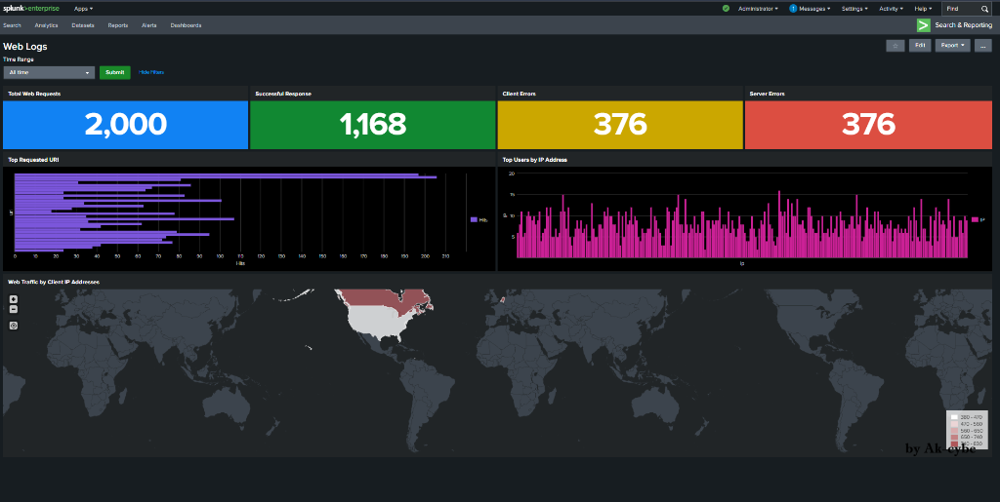
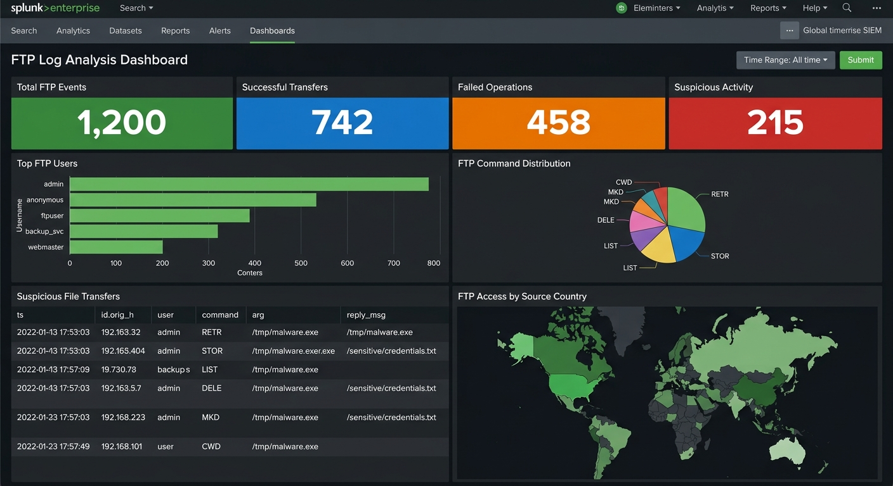
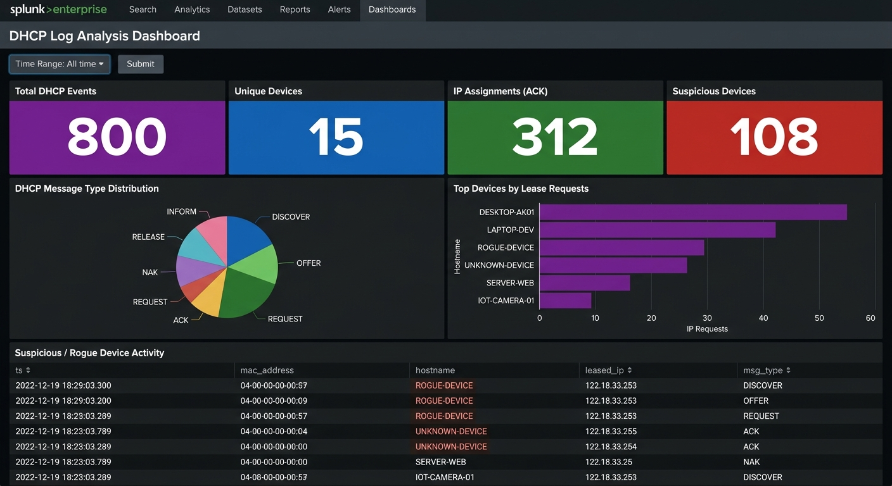

<div align="center">


<br/>


**A comprehensive SIEM lab portfolio with 8 Splunk dashboards covering SSH, Web Traffic, DNS, FTP, SMTP, DHCP, Tunnel, and AWS GuardDuty cloud threat analysis — built with SPL queries, importable XML, and geo-location threat intelligence.**

<br/>


</div>


##  What This Project Covers

This repository contains **8 complete Splunk SIEM dashboards** built from scratch — each with a step-by-step lab guide, SPL queries, importable XML, and real log data.

| # | Dashboard | Events | Key Skills | Guide |
|---|-----------|--------|-----------|-------|
| 1 | 🛡️ **SSH Log Analysis** | 1,201 SSH events | Brute-force detection, failed login analysis, geo-location mapping | [`SSH_LOG_ANALYSIS.md`](SSH_LOG_ANALYSIS.md) |
| 2 | 🌐 **Web Traffic Analysis** | 2,000 Apache events | HTTP status analysis, URI pattern detection, IP attribution | [`WEB_TRAFFIC_DASHBOARD.md`](WEB_TRAFFIC_DASHBOARD.md) |
| 3 | 🌐 **DNS Log Analysis** | 1,500 DNS events | DGA detection, NXDOMAIN analysis, suspicious domain hunting | [`DNS_LOG_ANALYSIS.md`](DNS_LOG_ANALYSIS.md) |
| 4 | 📁 **FTP Log Analysis** | 1,200 FTP events | File transfer monitoring, anonymous access detection, command analysis | [`FTP_LOG_ANALYSIS.md`](FTP_LOG_ANALYSIS.md) |
| 5 | 📧 **SMTP Log Analysis** | 1,000 email events | Phishing detection, attachment analysis, TLS compliance | [`SMTP_LOG_ANALYSIS.md`](SMTP_LOG_ANALYSIS.md) |
| 6 | 🖧 **DHCP Log Analysis** | 800 DHCP events | Rogue device detection, IP lease monitoring, asset discovery | [`DHCP_LOG_ANALYSIS.md`](DHCP_LOG_ANALYSIS.md) |
| 7 | 🔒 **Tunnel Log Analysis** | 1,000 tunnel events | Covert channel detection, protocol analysis, persistent backdoor hunting | [`TUNNEL_LOG_ANALYSIS.md`](TUNNEL_LOG_ANALYSIS.md) |
| 8 | ☁️ **AWS GuardDuty** | 1,000 findings | Cloud threat detection, MITRE ATT&CK mapping, S3→Splunk pipeline | [`AWS_GUARDDUTY_ANALYSIS.md`](AWS_GUARDDUTY_ANALYSIS.md) |


##  Dashboard Previews

### 🛡️ SSH Log Analysis Dashboard


> **Panels:** Total SSH Events · Successful Logins · Failed Logins · Invalid User Attempts · Failed Logins by Username · Brute Force IPs · Geo-Location Map

---

### 🌐 Web Traffic Analysis Dashboard



> **Panels:** Total Web Requests · Successful Responses · Client Errors (4xx) · Server Errors (5xx) · Top URIs · Top IPs · Geo-Location Map

---

### 🌐 DNS Log Analysis Dashboard


> **Panels:** Total DNS Queries · Successful Resolutions · NXDOMAIN Responses · Suspicious Queries · Top Queried Domains · Query Type Distribution · Suspicious Domain Table

---

### 📁 FTP Log Analysis Dashboard



> **Panels:** Total FTP Events · Successful Transfers · Failed Operations · Suspicious Activity · Top Users · Command Distribution · Geo-Location Map

---

### 📧 SMTP Log Analysis Dashboard


> **Panels:** Total Emails · With Attachments · Unencrypted (No TLS) · Suspicious Emails · Top Senders · Attachment Types · Geo-Location Map

---

### 🖧 DHCP Log Analysis Dashboard



> **Panels:** Total DHCP Events · Unique Devices · IP Assignments · Suspicious Devices · Message Type Distribution · Top Devices · Rogue Device Table

---

### 🔒 Tunnel Log Analysis Dashboard


> **Panels:** Total Tunnel Events · Tunnels Established · Tunnels Terminated · Suspicious Tunnels · Protocol Distribution · Top Sources · Geo-Location Map

---

### ☁️ AWS GuardDuty Cloud Threat Dashboard


> **Panels:** Total Findings · High/Medium/Low Severity · Finding Types · MITRE ATT&CK Tactics · Affected EC2 Instances · Compromised IAM Users · High Severity Detail Table · Threat Source Map


##  Skills Demonstrated

| Category | Skills |
|----------|--------|
| **SIEM Operations** | Dashboard creation, panel configuration, shared time tokens, XML source editing |
| **SPL Queries** | `stats count`, `dc()`, `top`, `where`, `table`, `iplocation`, `geom`, `sort`, field filtering |
| **Threat Detection** | Brute-force identification, DGA/C2 detection, phishing triage, rogue device hunting, covert channel analysis |
| **Cloud Security** | AWS GuardDuty, S3→SQS→Splunk pipeline, IAM credential compromise response, MITRE ATT&CK Cloud mapping |
| **Log Analysis** | SSH, Apache, DNS, FTP, SMTP, DHCP, Tunnel, GuardDuty logs (JSON) — 8 source types |
| **Geo-Intelligence** | IP-to-country resolution, choropleth mapping, geo-blocking recommendations |
| **SOC Workflow** | Alert triage mindset, threat hunting queries, incident response playbooks, analyst tips embedded throughout |


##  Quick Start

### Option 1 — Follow the Step-by-Step Guide

1. Pick a dashboard from the table above
2. Upload the corresponding log data from the `data/` folder into Splunk
3. Follow the task-by-task instructions to build each panel manually
4. Learn SPL by doing ✅

### Option 2 — One-Click XML Import

1. Open Splunk → **Dashboards** → **Create New Dashboard**
2. Click **Edit** → **Source** (top-left)
3. Paste the XML from any of the 8 dashboard files in `xml/`:
   - [`xml/ssh_dashboard.xml`](xml/ssh_dashboard.xml) — SSH Dashboard
   - [`xml/web_traffic_dashboard.xml`](xml/web_traffic_dashboard.xml) — Web Traffic Dashboard
   - [`xml/dns_dashboard.xml`](xml/dns_dashboard.xml) — DNS Dashboard
   - [`xml/ftp_dashboard.xml`](xml/ftp_dashboard.xml) — FTP Dashboard
   - [`xml/smtp_dashboard.xml`](xml/smtp_dashboard.xml) — SMTP Dashboard
   - [`xml/dhcp_dashboard.xml`](xml/dhcp_dashboard.xml) — DHCP Dashboard
   - [`xml/tunnel_dashboard.xml`](xml/tunnel_dashboard.xml) — Tunnel Dashboard
   - [`xml/guardduty_dashboard.xml`](xml/guardduty_dashboard.xml) — AWS GuardDuty Dashboard
4. Click **Save** → Done 🚀


##  Project Structure

```
splunk-soc-project/
│
├── 📄 README.md                          ← You are here
├── 📄 SSH_LOG_ANALYSIS.md                ← SSH Dashboard guide
├── 📄 WEB_TRAFFIC_DASHBOARD.md           ← Web Traffic Dashboard guide
├── 📄 DNS_LOG_ANALYSIS.md                ← DNS Dashboard guide
├── 📄 FTP_LOG_ANALYSIS.md                ← FTP Dashboard guide
├── 📄 SMTP_LOG_ANALYSIS.md               ← SMTP Dashboard guide
├── 📄 DHCP_LOG_ANALYSIS.md               ← DHCP Dashboard guide
├── 📄 TUNNEL_LOG_ANALYSIS.md             ← Tunnel Dashboard guide
├── 📄 AWS_GUARDDUTY_ANALYSIS.md          ← AWS GuardDuty Cloud guide
│
├── 📁 screenshots/
│   ├── 🖼️ dashboard-complete.png         ← SSH dashboard screenshot
│   ├── 🖼️ web-traffic-dashboard.png      ← Web Traffic screenshot
│   ├── 🖼️ dns-dashboard.png              ← DNS screenshot
│   ├── 🖼️ ftp-dashboard.png              ← FTP screenshot
│   ├── 🖼️ smtp-dashboard.png             ← SMTP screenshot
│   ├── 🖼️ dhcp-dashboard.png             ← DHCP screenshot
│   ├── 🖼️ tunnel-dashboard.png           ← Tunnel screenshot
│   └── 🖼️ guardduty-dashboard.png        ← GuardDuty screenshot
│
├── 📁 data/
│   ├── 📊 ssh_logs_new.json              ← 1,201 SSH authentication events
│   ├── 📊 apache_logs.json               ← 2,000 Apache web traffic events
│   ├── 📊 dns_logs.json                  ← 1,500 DNS query events
│   ├── 📊 ftp_logs.json                  ← 1,200 FTP transfer events
│   ├── 📊 smtp_logs.json                 ← 1,000 SMTP email events
│   ├── 📊 dhcp_logs.json                 ← 800 DHCP lease events
│   ├── 📊 tunnel_logs.json               ← 1,000 tunnel traffic events
│   └── 📊 guardduty_findings.json        ← 1,000 AWS GuardDuty findings
│
└── 📁 xml/
    ├── 📝 ssh_dashboard.xml              ← Importable Splunk XML (SSH)
    ├── 📝 web_traffic_dashboard.xml      ← Importable Splunk XML (Web Traffic)
    ├── 📝 dns_dashboard.xml              ← Importable Splunk XML (DNS)
    ├── 📝 ftp_dashboard.xml              ← Importable Splunk XML (FTP)
    ├── 📝 smtp_dashboard.xml             ← Importable Splunk XML (SMTP)
    ├── 📝 dhcp_dashboard.xml             ← Importable Splunk XML (DHCP)
    ├── 📝 tunnel_dashboard.xml           ← Importable Splunk XML (Tunnel)
    └── 📝 guardduty_dashboard.xml        ← Importable Splunk XML (GuardDuty)
```


##  Prerequisites

| Requirement | Details |
|-------------|---------|
| **Splunk** | Enterprise (local) or Cloud — [free trial](https://www.splunk.com/en_us/download.html) works |
| **GeoIP** | Built-in `iplocation` command + `geo_countries` lookup (ships with Splunk) |
| **Knowledge** | Basic SPL, network protocols (SSH, HTTP, DNS, FTP, SMTP, DHCP), tunneling concepts, AWS basics |


##  Data Sources Overview

### SSH Logs (`ssh_logs_new.json`) — 1,201 events

| Field | Example | Purpose |
|-------|---------|---------|
| `id.orig_h` | `31.184.137.182` | Source IP (attacker) |
| `event_type` | `Failed SSH Login` | Event classification |
| `username` | `root`, `admin` | Targeted account |
| `auth_attempts` | `8` | Number of auth attempts per session |

### Apache Logs (`apache_logs.json`) — 2,000 events

| Field | Example | Purpose |
|-------|---------|---------|
| `ip` | `185.62.57.52` | Client IP |
| `method` | `GET` | HTTP method |
| `uri` | `/wp-admin` | Requested URI |
| `status` | `403` | HTTP response code |

### DNS Logs (`dns_logs.json`) — 1,500 events

| Field | Example | Purpose |
|-------|---------|---------|
| `query` | `malware-c2.evil.com` | Queried domain name |
| `qtype_name` | `A`, `TXT`, `MX` | DNS query type |
| `rcode_name` | `NOERROR`, `NXDOMAIN` | DNS response code |
| `classification` | `Suspicious` | Threat classification |

### FTP Logs (`ftp_logs.json`) — 1,200 events

| Field | Example | Purpose |
|-------|---------|---------|
| `user` | `anonymous`, `admin` | FTP username |
| `command` | `RETR`, `STOR`, `DELE` | FTP command |
| `arg` | `/tmp/malware.exe` | Target file path |
| `reply_code` | `226`, `550` | FTP reply code |

### SMTP Logs (`smtp_logs.json`) — 1,000 events

| Field | Example | Purpose |
|-------|---------|---------|
| `mailfrom` | `noreply@phishing-site.tk` | Sender email address |
| `rcptto` | `ceo@company.com` | Recipient email |
| `subject` | `URGENT: Password Reset` | Email subject line |
| `attachment_type` | `.exe`, `.pdf` | Attachment file type |

### DHCP Logs (`dhcp_logs.json`) — 800 events

| Field | Example | Purpose |
|-------|---------|---------|
| `msg_type` | `DISCOVER`, `ACK` | DHCP message type |
| `mac_address` | `DE:AD:BE:EF:00:01` | Device MAC address |
| `hostname` | `ROGUE-DEVICE` | Device hostname |
| `leased_ip` | `192.168.1.105` | Assigned IP address |

### Tunnel Logs (`tunnel_logs.json`) — 1,000 events

| Field | Example | Purpose |
|-------|---------|---------|
| `tunnel_type` | `GRE`, `Teredo`, `6to4` | Tunnel protocol |
| `action` | `tunnel_established` | Tunnel event type |
| `orig_bytes` | `245000` | Data transferred (bytes) |
| `classification` | `Suspicious` | Threat classification |

### GuardDuty Findings (`guardduty_findings.json`) — 1,000 findings

| Field | Example | Purpose |
|-------|---------|---------|
| `type` | `CryptoCurrency:EC2/BitcoinTool.B!DNS` | GuardDuty finding type |
| `severity` | `8` | Numeric severity (1-10) |
| `tactic` | `Impact` | MITRE ATT&CK tactic |
| `resourceType` | `EC2`, `IAMUser`, `S3Bucket` | Affected AWS resource |
| `sourceIP` | `91.234.56.78` | Threat actor source IP |
| `sourceCountry` | `Russia` | Geo-location of threat |


##  Roadmap

- [x] SSH Log Analysis Dashboard + Guide
- [x] Web Traffic Analysis Dashboard + Guide
- [x] DNS Log Analysis Dashboard + Guide
- [x] FTP Log Analysis Dashboard + Guide
- [x] SMTP Log Analysis Dashboard + Guide
- [x] DHCP Log Analysis Dashboard + Guide
- [x] Tunnel Log Analysis Dashboard + Guide
- [x] AWS GuardDuty Cloud Threat Dashboard + Guide
- [x] Standalone XML files for all 8 dashboards
- [x] Real log data with attack patterns (8,701 total events)
- [x] Dashboard screenshots
- [ ] Windows Event Log Dashboard
- [ ] Firewall Log Analysis Dashboard
- [ ] Automated Alert Rules (saved searches)


👤 **About the owner**

🔒 **[Jagbir Yadav](https://github.com/jagbir-yadav)**

🎓 BCA graduate (Mangalmay Institute of Management and Technology, Greater Noida) | Cybersecurity & SOC Analyst Enthusiast

☁️ Networking & SIEM | 🔍 Threat Detection

🎯 Building Practical SOC Skills Through Hands-On Detection Engineering


<div align="center">

### 💀 Threat Coverage Matrix

```
┌─────────────────────────────────────────────────────────────────┐
│                    MITRE ATT&CK Coverage                       │
├──────────────────┬──────────────────┬───────────────────────────┤
│ 🔍 Reconnaissance│ 🚪 Initial Access│ 🔑 Credential Access      │
│   DNS, Tunnel    │  SSH, GuardDuty  │  SSH, FTP, IAM            │
├──────────────────┼──────────────────┼───────────────────────────┤
│ 📤 Exfiltration  │ 💣 Impact        │ 🕵️ Command & Control       │
│  FTP, S3, SMTP   │  GuardDuty       │  DNS, Tunnel              │
├──────────────────┼──────────────────┼───────────────────────────┤
│ 🔄 Persistence   │ ⬆️ Priv Escalation│ 🛡️ Defense Evasion       │
│  DHCP, IAM       │  GuardDuty       │  Tunnel, GuardDuty        │
└──────────────────┴──────────────────┴───────────────────────────┘
```

</div>


<div align="center">


**📜 License:** [MIT](LICENSE) — Free to use, modify, and share


</div>
