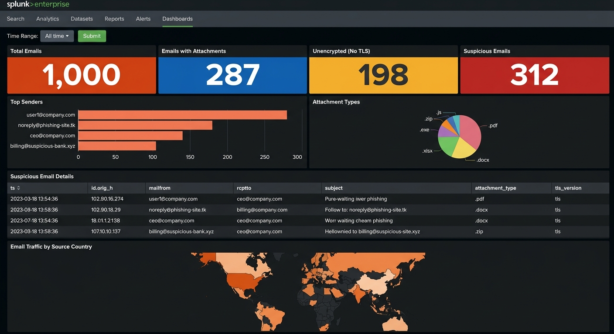

<div align="center">


</div>

> **Project Type:** SOC Analyst Lab — SIEM Dashboard Building  
> **Platform:** Splunk Enterprise / Splunk Cloud  
> **Data Source:** `smtp_logs.json` (1,000 events)  
> **Skill Level:** Beginner → Intermediate

## 📸 Completed Dashboard




## 📋 Table of Contents

| #   | Section                                              | Status |
| --- | ---------------------------------------------------- | ------ |
| 0   | [Lab Setup & Prerequisites](#lab-setup--prerequisites) | ⬜      |
| 1   | [Task 0 — Time Range Input](#task-0--setting-up-time-range) | ⬜      |
| 2   | [Task 1 — Email Overview Panels](#task-1--email-overview-panels) | ⬜      |
| 3   | [Task 2 — Email Patterns](#task-2--email-patterns) | ⬜      |
| 4   | [Task 3 — Suspicious Email Detail & Geo-Location](#task-3--suspicious-email-detail--geo-location) | ⬜      |
| 5   | [Final Dashboard Layout](#final-dashboard-layout)    | ⬜      |


## Lab Setup & Prerequisites

### What You Need

| Requirement            | Details                                                                 |
| ---------------------- | ----------------------------------------------------------------------- |
| **Splunk Instance**    | Splunk Enterprise (local) or Splunk Cloud (free trial works)            |
| **Data File**          | `smtp_logs.json` → host `MailServer` (1,000 email events)              |
| **Sourcetype**         | `_json` for JSON logs                                                   |
| **Key Fields**         | `mailfrom`, `rcptto`, `subject`, `has_attachment`, `tls_version`, `classification` |

### Data Ingestion

1. **Upload `smtp_logs.json`**
   - Settings → Add Data → Upload → select `smtp_logs.json`
   - Set **Host** = `MailServer`, **Sourcetype** = `_json`
   - Review & Submit

2. **Verify ingestion:**
   ```spl
   source="smtp_logs.json" host="MailServer" | head 10
   ```

### Create the Dashboard

1. Go to **Dashboards** → **Create New Dashboard**
2. Name it **SMTP Log Analysis Dashboard**
3. Select **Classic Dashboard** (Simple XML)
4. Choose **Absolute** layout → Click **Create**


##  Task 0 — Setting Up Time Range

| # | Action |
|---|--------|
| 1 | Click **`+ Add Input`** → Select **Time** |
| 2 | Set **Label** → `Time Range`, **Token** → `time_range` |
| 3 | Click **`+ Add Input`** → Select **Submit** |


##  Task 1 — Email Overview Panels

**Goal:** At-a-glance email traffic metrics — total emails, attachment count, unencrypted transmission count, and suspicious email indicators.

> 🎯 All four panels are **Single Value** visualizations.

---

### Panel 1.1 — Total Emails

**SPL Query:**

```spl
source="smtp_logs.json" host="MailServer" sourcetype="_json"
| stats count AS "Total Emails"
```

**What this does:** Baseline metric — total email volume. Sudden spikes may indicate spam campaigns or phishing waves targeting your organization.

---

### Panel 1.2 — Emails with Attachments

**SPL Query:**

```spl
source="smtp_logs.json" host="MailServer" sourcetype="_json" has_attachment="true"
| stats count AS "With Attachments"
```

**What this does:** Counts emails carrying file attachments. Attachments are the #1 malware delivery vector — monitoring attachment volume helps detect phishing campaigns.

> 🔍 **SOC Analyst Tip:** Correlate this with the attachment type distribution (Task 2). A spike in `.exe` or `.js` attachments from external senders is an immediate red flag.

---

### Panel 1.3 — Unencrypted Emails (No TLS)

**SPL Query:**

```spl
source="smtp_logs.json" host="MailServer" sourcetype="_json" tls_version="none"
| stats count AS "Unencrypted Emails"
```

**What this does:** Identifies emails sent without TLS encryption. Unencrypted SMTP traffic exposes email content (including credentials, confidential data) to network sniffing attacks.

> ⚠️ **Compliance Note:** Many regulations (GDPR, HIPAA, PCI-DSS) require email encryption. A high count of unencrypted emails may be a compliance violation.

---

### Panel 1.4 — Suspicious Emails

**SPL Query:**

```spl
source="smtp_logs.json" host="MailServer" sourcetype="_json" classification="Suspicious"
| stats count AS "Suspicious Emails"
```

**What this does:** Counts emails classified as suspicious — phishing sender domains, dangerous attachment types (`.exe`, `.js`), social engineering subjects (wire transfer requests, compromised account alerts).

---

### ✅ Task 1 Result

| Total Emails | With Attachments | Unencrypted (No TLS) | Suspicious Emails |
|----|----|----|-----|


##  Task 2 — Email Patterns

**Goal:** Identify top senders and attachment type distribution — critical for detecting compromised mailboxes and phishing campaigns.

---

### Panel 2.1 — Top Senders (Bar Chart)

**SPL Query:**

```spl
source="smtp_logs.json" host="MailServer" sourcetype="_json"
| top limit=10 mailfrom
```

**What this does:** Ranks email senders by volume. Anomalies to watch:
- External addresses (`.tk`, `.xyz`, `.ru`) sending high volumes → phishing campaigns
- Internal accounts sending unusual volumes → compromised mailbox / BEC attack
- `noreply@phishing-site.tk` appearing prominently → active phishing attempt

> 🔍 **SOC Analyst Tip:** Cross-reference top external senders with reputation services. Check SPF/DKIM/DMARC alignment for suspicious domains.

---

### Panel 2.2 — Attachment Types (Pie Chart)

**SPL Query:**

```spl
source="smtp_logs.json" host="MailServer" sourcetype="_json" has_attachment="true"
| stats count by attachment_type
```

**What this does:** Shows distribution of attachment file types. Security-critical types:
- **`.exe`** — Direct malware execution risk (should be blocked at the gateway)
- **`.js`** — JavaScript dropper (common phishing payload)
- **`.zip`** — May contain password-protected malware (evades scanning)
- **`.docx/.xlsx`** — Macro-enabled documents (Office macro malware)
- **`.pdf`** — Generally safe, but can contain embedded exploits

---

### ✅ Task 2 Result

| Top Senders (Bar Chart) | Attachment Types (Pie Chart) |
|---|---|


##  Task 3 — Suspicious Email Detail & Geo-Location

**Goal:** Deep-dive into suspicious emails and map email traffic origins geographically.

---

### Panel 3.1 — Suspicious Email Details (Statistics Table)

**SPL Query:**

```spl
source="smtp_logs.json" host="MailServer" sourcetype="_json" classification="Suspicious"
| table ts, id.orig_h, mailfrom, rcptto, subject, attachment_type, tls_version
| sort -ts
```

**What this does:** Investigation-ready table showing every suspicious email with timestamp, source IP, sender, recipient, subject, attachment type, and TLS status. This is your phishing triage view.

> 🔍 **SOC Analyst Phishing Triage Checklist:**
> 1. Check sender domain reputation (VirusTotal, urlscan.io)
> 2. Analyze the subject line for social engineering patterns
> 3. Check if attachment type is executable (`.exe`, `.js`, `.bat`)
> 4. Verify TLS status — phishing servers often lack TLS
> 5. Check if the internal recipient actually expects this communication
> 6. Escalate as phishing incident if 3+ indicators match

---

### Panel 3.2 — Email Traffic by Source Country (Choropleth Map)

**SPL Query:**

```spl
source="smtp_logs.json" host="MailServer" sourcetype="_json"
| table id.orig_h
| iplocation id.orig_h
| stats count by Country
| geom geo_countries featureIdField="Country"
```

**What this does:** World heatmap of email traffic origins. Helps identify email from unexpected regions — critical for detecting geographically-targeted phishing campaigns.

---

### ✅ Task 3 Result

> Row 3: Suspicious email details table. Row 4: Email traffic geo-location map.


## 🏁 Final Dashboard Layout

| Row | Panels | Visualization Type |
|-----|--------|-------------------|
| **Input Bar** | Time Range + Submit | Input controls |
| **Row 1** | Total Emails · With Attachments · Unencrypted · Suspicious Emails | 4× Single Value |
| **Row 2** | Top Senders · Attachment Types | Bar Chart + Pie Chart |
| **Row 3** | Suspicious Email Details | Statistics Table (full width) |
| **Row 4** | Email Traffic by Source Country | Choropleth Map (full width) |

---

##  Complete Simple XML Reference

The full dashboard XML is available at [`xml/smtp_dashboard.xml`](xml/smtp_dashboard.xml). Import via **Dashboards** → **Create** → **Edit** → **Source** → Paste → **Save** ✅


## 🔑 Key Takeaways for SOC Analysts

| Concept | What You Practiced |
|---------|-------------------|
| **Email Security Monitoring** | Building dashboards for SMTP traffic visibility |
| **Phishing Detection** | Identifying suspicious senders, subjects, and attachment types |
| **Encryption Compliance** | Monitoring TLS usage for regulatory compliance |
| **Attachment Analysis** | Categorizing file types by risk level (`.exe` vs `.pdf`) |
| **SPL Commands** | `stats count`, `top`, `table`, `iplocation`, `geom`, `sort` |

---

## 📂 Project Structure

```
splunk-soc-project/
├── SMTP_LOG_ANALYSIS.md               ← This file
├── data/
│   └── smtp_logs.json                 ← Email traffic data (1,000 events)
└── xml/
    └── smtp_dashboard.xml              ← Importable Splunk XML
```


<div align="center">


</div>

<div align="center">

[](README.md)

</div>


