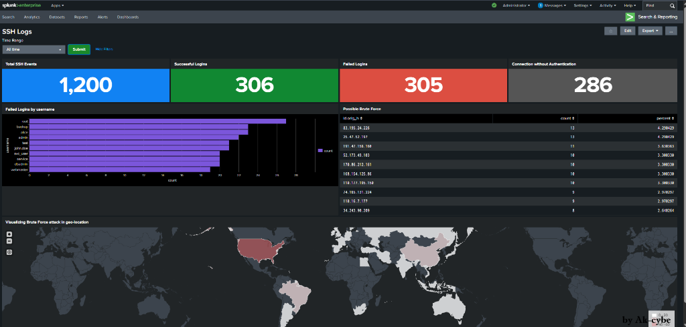

<div align="center">


</div>

> **Project Type:** SOC Analyst Lab — SIEM Dashboard Building  
> **Platform:** Splunk Enterprise / Splunk Cloud  
> **Data Sources:** `ssh_logs.json`, `ssh_logs_new.json`, `auth` (syslog)  
> **Skill Level:** Beginner → Intermediate

## 📸 Completed Dashboard




## 📋 Table of Contents

| #   | Section                                              | Status |
| --- | ---------------------------------------------------- | ------ |
| 0   | [Lab Setup & Prerequisites](#lab-setup--prerequisites) | ⬜      |
| 1   | [Task 0 — Time Range Input](#task-0--setting-up-time-range) | ⬜      |
| 2   | [Task 1 — Authentication Overview Panels](#task-1--authentication-overview-panels) | ⬜      |
| 3   | [Task 2 — Login Activity Trends](#task-2--login-activity-trends) | ⬜      |
| 4   | [Task 3 — Geo-Location Brute Force Map](#task-3--visualizing-brute-force-attack-in-geo-location) | ⬜      |
| 5   | [Final Dashboard Layout](#final-dashboard-layout)    | ⬜      |


## Lab Setup & Prerequisites

### What You Need

| Requirement            | Details                                                                 |
| ---------------------- | ----------------------------------------------------------------------- |
| **Splunk Instance**    | Splunk Enterprise (local) or Splunk Cloud (free trial works)            |
| **Data Files**         | `ssh_logs.json` → host `LinuxServer` · `ssh_logs_new.json` → host `LinuxNew` |
| **Index**              | Default (`main`) + `auth` index for syslog-based SSH data              |
| **Sourcetype**         | `_json` for JSON logs                                                   |
| **Geo Lookup**         | `iplocation` command + built-in `geo_countries` lookup (ships with Splunk) |

### Data Ingestion Checklist

1. **Upload `ssh_logs.json`**
   - Settings → Add Data → Upload → select `ssh_logs.json`
   - Set **Host** = `LinuxServer`, **Sourcetype** = `_json`
   - Review & Submit

2. **Upload `ssh_logs_new.json`**
   - Same flow. Set **Host** = `LinuxNew`, **Sourcetype** = `_json`

3. **Verify ingestion** — run a quick search:
   ```spl
   source="ssh_logs.json" OR source="ssh_logs_new.json" | head 10
   ```

### Create the Dashboard

1. Go to **Dashboards** → **Create New Dashboard**
2. Name it **SSH Log Analysis Dashboard**
3. Select **Dashboard Studio** (or Classic depending on your Splunk version)
4. Choose **Absolute** layout (recommended for multi-panel dashboards)
5. Click **Create**

> 💡 This guide uses **Classic Dashboard (Simple XML)** editor steps. If you're on Dashboard Studio, the UI will differ slightly but the SPL queries remain identical.


##  Task 0 — Setting Up Time Range

**Why:** Every panel in this dashboard should respect a single, shared time picker so analysts can pivot across the same window without editing each panel individually.

### Step-by-Step

#### 1. Add Time Range Input

| # | Action |
|---|--------|
| 1 | Inside the dashboard editor, click **`+ Add Input`** (top bar) |
| 2 | Select **Time** from the dropdown |
| 3 | Click the **✏️ pencil icon** on the newly added time picker |
| 4 | Set **Label** → `Time Range` |
| 5 | Set **Token** → `time_range` |
| 6 | *(Optional)* Set a **Default** value — e.g. `Last 24 hours` |
| 7 | Click **Apply** |

#### 2. Add Submit Button

| # | Action |
|---|--------|
| 1 | Click **`+ Add Input`** again |
| 2 | Select **Submit** |

> ⚠️ **Important:** For **every panel** created below, you must set its time range to use the **Shared Time Picker (`time_range`)** token. This ensures all panels update together when the analyst changes the time window.

### Resulting Simple XML (Reference)

```xml
<input type="time" token="time_range">
  <label>Time Range</label>
  <default>
    <earliest>-24h@h</earliest>
    <latest>now</latest>
  </default>
</input>
```


##  Task 1 — Authentication Overview Panels

**Goal:** Provide a quick, at-a-glance summary of SSH activity — total events, successes, failures, and invalid-user attempts.

> 🎯 All four panels in this task are **Single Value** visualizations — big numbers designed for executive/analyst dashboards.

---

### Panel 1.1 — Total SSH Events

| Setting          | Value                          |
| ---------------- | ------------------------------ |
| **Panel Type**   | Single Value                   |
| **Time Picker**  | Shared Time Picker `time_range` |
| **Content Title**| Total SSH Events               |

**Steps:**

1. Click **`+ Add Panel`**
2. Under **New**, choose **Single Value**
3. Set **Time Range** → Use Shared Time Picker (`time_range`)
4. Set **Content Title** → `Total SSH Events`
5. Paste the search string below and click **Apply**

**SPL Query:**

```spl
source="ssh_logs.json" host="LinuxServer" sourcetype="_json"
| stats count AS "Total SSH Events"
```

**What this does:**  
Counts every event from the `ssh_logs.json` source on the `LinuxServer` host — a baseline metric showing total SSH log volume in the selected time window.

---

### Panel 1.2 — Successful Logins

| Setting          | Value                          |
| ---------------- | ------------------------------ |
| **Panel Type**   | Single Value                   |
| **Time Picker**  | Shared Time Picker `time_range` |
| **Content Title**| Successful Logins              |

**Steps:**

1. Click **`+ Add Panel`**
2. Under **New**, choose **Single Value**
3. Set **Time Range** → Use Shared Time Picker (`time_range`)
4. Set **Content Title** → `Successful Logins`
5. Paste the search string below and click **Apply**

**SPL Query:**

```spl
source="ssh_logs.json" host="LinuxServer" sourcetype="_json" event_type="Successful SSH Login"
| stats count AS "Successful Logins"
```

**What this does:**  
Filters for events where `event_type` equals `Successful SSH Login` and returns the count — lets analysts immediately see how many legitimate (or seemingly legitimate) sessions were established.

---

### Panel 1.3 — Failed Logins

| Setting          | Value                          |
| ---------------- | ------------------------------ |
| **Panel Type**   | Single Value                   |
| **Time Picker**  | Shared Time Picker `time_range` |
| **Content Title**| Failed Logins                  |

**Steps:**

1. Click **`+ Add Panel`**
2. Under **New**, choose **Single Value**
3. Set **Time Range** → Use Shared Time Picker (`time_range`)
4. Set **Content Title** → `Failed Logins`
5. Paste the search string below and click **Apply**

**SPL Query:**

```spl
source="ssh_logs.json" host="LinuxServer" sourcetype="_json" event_type="Failed SSH Login"
| stats count AS "Failed Login"
```

**What this does:**  
Isolates failed SSH login events — a high count here is your first indicator of potential brute-force or credential-stuffing attacks.

> 🔍 **SOC Analyst Tip:** Compare this number against "Successful Logins". A ratio of failed:successful > 10:1 in a short window is a red flag worth investigating.

---

### Panel 1.4 — Invalid User Attempts

| Setting          | Value                          |
| ---------------- | ------------------------------ |
| **Panel Type**   | Single Value                   |
| **Time Picker**  | Shared Time Picker `time_range` |
| **Content Title**| Invalid User Attempts          |

**Steps:**

1. Click **`+ Add Panel`**
2. Under **New**, choose **Single Value**
3. Set **Time Range** → Use Shared Time Picker (`time_range`)
4. Set **Content Title** → `Invalid User Attempts`
5. Paste the search string below and click **Apply**

**SPL Query:**

```spl
index=auth "sshd" "invalid user"
| stats count AS "Invalid User Attempts"
```

**What this does:**  
Searches the `auth` index (syslog data) for SSH daemon entries containing "invalid user" — these are connections attempted with usernames that don't exist on the system. High counts indicate automated scanning/dictionary attacks.

> ⚠️ **Note:** This panel uses a different data source (`index=auth` / syslog) than the JSON-based panels above. Make sure your syslog data is being ingested into the `auth` index.

---

### ✅ Task 1 Result

> Refer to the [completed dashboard screenshot](#-completed-dashboard) at the top — Row 1 shows all four Single Value panels with live data.


##  Task 2 — Login Activity Trends

**Goal:** Visualize login behavior over time and detect spikes — move from numbers to patterns.

---

### Panel 2.1 — Failed Logins by Username (Bar Chart)

| Setting          | Value                                |
| ---------------- | ------------------------------------ |
| **Panel Type**   | Bar Chart                            |
| **Time Picker**  | Shared Time Picker `time_range`       |
| **Content Title**| Failed Logins by username            |

**Steps:**

1. Click **`+ Add Panel`**
2. Under **New**, choose **Bar Chart**
3. Set **Time Range** → Use Shared Time Picker (`time_range`)
4. Set **Content Title** → `Failed Logins by username`
5. Paste the search string below and click **Apply**

**SPL Query:**

```spl
source="ssh_logs_new.json" host="LinuxNew" sourcetype="_json" event_type="Failed SSH Login"
| top username
```

**What this does:**  
Uses the `top` command to find the most frequently targeted usernames in failed login attempts. The bar chart makes it instantly visible which accounts are under attack — common targets include `root`, `admin`, `test`, and service accounts.

> 🔍 **SOC Analyst Tip:** If you see a legitimate employee's username being brute-forced, escalate immediately — the attacker may have harvested valid usernames via OSINT or a prior breach.

> ⚠️ **Note:** This panel uses `ssh_logs_new.json` with host `LinuxNew` — a different data source than Task 1's panels.

---

### Panel 2.2 — Possible Brute Force by IP Address (Statistics Table)

| Setting          | Value                                     |
| ---------------- | ----------------------------------------- |
| **Panel Type**   | Statistics Table                          |
| **Time Picker**  | Shared Time Picker `time_range`            |
| **Content Title**| Possible Brute Force by IP Address        |

**Steps:**

1. Click **`+ Add Panel`**
2. Under **New**, choose **Statistics Table**
3. Set **Time Range** → Use Shared Time Picker (`time_range`)
4. Set **Content Title** → `Possible Brute Force by IP Address`
5. Paste the search string below and click **Apply**

**SPL Query:**

```spl
source="ssh_logs_new.json" host="LinuxNew" sourcetype="_json" event_type="Multiple Failed Authentication Attempts"
| top id.orig_h
```

**What this does:**  
Filters for events flagged as `Multiple Failed Authentication Attempts` and ranks the originating IP addresses (`id.orig_h`) by frequency. The statistics table format gives you the exact count + percentage for each IP — ideal for identifying the top offenders to block at the firewall.

> 🔍 **SOC Analyst Tip:** Cross-reference the top IPs with threat intelligence feeds (AbuseIPDB, VirusTotal, Shodan) to determine if they're known malicious infrastructure.

---

### ✅ Task 2 Result

> Refer to the [completed dashboard screenshot](#-completed-dashboard) at the top — Row 2 shows the Bar Chart (left) and Statistics Table (right) with live data.


##  Task 3 — Visualizing Brute Force Attack in Geo-Location

**Goal:** Map brute-force attack origins on a world choropleth to identify geographic hotspots — critical for threat intelligence and firewall geo-blocking decisions.

---

### Panel 3.1 — Brute Force Attack with Geo-Location (Choropleth Map)

| Setting          | Value                                       |
| ---------------- | ------------------------------------------- |
| **Panel Type**   | Choropleth Map                              |
| **Time Picker**  | Shared Time Picker `time_range`              |
| **Content Title**| Brute Force attack with geo-location        |

**Steps:**

1. Click **`+ Add Panel`**
2. Under **New**, choose **Choropleth Map**
3. Set **Time Range** → Use Shared Time Picker (`time_range`)
4. Set **Content Title** → `Brute Force attack with geo-location`
5. Paste the search string below and click **Apply**

**SPL Query:**

```spl
source="ssh_logs_new.json" host="LinuxNew" sourcetype="_json" event_type="Multiple Failed Authentication Attempts"
| table id.orig_h
| iplocation id.orig_h
| stats count by Country
| geom geo_countries featureIdField="Country"
```

**SPL Breakdown (line by line):**

| Line | Command | Purpose |
|------|---------|---------|
| 1 | `source=... event_type="Multiple Failed..."` | Filter to brute-force events only |
| 2 | `\| table id.orig_h` | Extract just the source IP field |
| 3 | `\| iplocation id.orig_h` | Resolve each IP to Country, City, lat/lon using Splunk's built-in MaxMind GeoIP database |
| 4 | `\| stats count by Country` | Aggregate: how many brute-force attempts originated from each country |
| 5 | `\| geom geo_countries featureIdField="Country"` | Map the country names to the `geo_countries` lookup for choropleth rendering |

**What this does:**  
Creates a world heatmap where countries are shaded by brute-force attack volume. Darker shading = more attacks from that region. This is the visualization that makes the biggest impact in SOC reports and presentations to management.

> 🔍 **SOC Analyst Tip:** If 80%+ of attacks come from countries where your organization has no business presence, recommend geo-blocking those ranges at the perimeter firewall — it's a cheap, high-impact control.

> ⚠️ **Prerequisites for this panel:**
> - Splunk's `iplocation` command requires the MaxMind GeoIP database (ships with Splunk Enterprise by default)
> - The `geo_countries` lookup must be available (built-in with Splunk)
> - Private/RFC1918 IPs (10.x, 172.16.x, 192.168.x) will return no location data

---

### ✅ Task 3 Result

> Refer to the [completed dashboard screenshot](#-completed-dashboard) at the top — Row 3 shows the Choropleth Map with brute-force attack origins highlighted by country.


## 🏁 Final Dashboard Layout

### Row Structure Summary

| Row | Panels | Visualization Type |
|-----|--------|--------------------|
| **Input Bar** | Time Range + Submit | Input controls |
| **Row 1** | Total SSH Events · Successful Logins · Failed Logins · Invalid User Attempts | 4× Single Value |
| **Row 2** | Failed Logins by Username · Possible Brute Force by IP | Bar Chart + Statistics Table |
| **Row 3** | Brute Force Geo-Location Map | Choropleth Map (full width) |

---

##  Complete Simple XML Reference

Below is the full dashboard XML you can import directly into Splunk if you prefer to skip the UI-based setup:

```xml
<form>
  <label>SSH Log Analysis Dashboard</label>
  <description>SOC Analyst Dashboard — SSH Authentication Monitoring &amp; Brute Force Detection</description>

  <!-- ==================== INPUT: Time Range ==================== -->
  <fieldset submitButton="true">
    <input type="time" token="time_range">
      <label>Time Range</label>
      <default>
        <earliest>-24h@h</earliest>
        <latest>now</latest>
      </default>
    </input>
  </fieldset>

  <!-- ==================== ROW 1: Authentication Overview ==================== -->
  <row>
    <panel>
      <title>Total SSH Events</title>
      <single>
        <search>
          <query>source="ssh_logs.json" host="LinuxServer" sourcetype="_json"
| stats count AS "Total SSH Events"</query>
          <earliest>$time_range.earliest$</earliest>
          <latest>$time_range.latest$</latest>
        </search>
      </single>
    </panel>

    <panel>
      <title>Successful Logins</title>
      <single>
        <search>
          <query>source="ssh_logs.json" host="LinuxServer" sourcetype="_json" event_type="Successful SSH Login"
| stats count AS "Successful Logins"</query>
          <earliest>$time_range.earliest$</earliest>
          <latest>$time_range.latest$</latest>
        </search>
      </single>
    </panel>

    <panel>
      <title>Failed Logins</title>
      <single>
        <search>
          <query>source="ssh_logs.json" host="LinuxServer" sourcetype="_json" event_type="Failed SSH Login"
| stats count AS "Failed Login"</query>
          <earliest>$time_range.earliest$</earliest>
          <latest>$time_range.latest$</latest>
        </search>
      </single>
    </panel>

    <panel>
      <title>Invalid User Attempts</title>
      <single>
        <search>
          <query>index=auth "sshd" "invalid user"
| stats count AS "Invalid User Attempts"</query>
          <earliest>$time_range.earliest$</earliest>
          <latest>$time_range.latest$</latest>
        </search>
      </single>
    </panel>
  </row>

  <!-- ==================== ROW 2: Login Activity Trends ==================== -->
  <row>
    <panel>
      <title>Failed Logins by username</title>
      <chart>
        <search>
          <query>source="ssh_logs_new.json" host="LinuxNew" sourcetype="_json" event_type="Failed SSH Login"
| top username</query>
          <earliest>$time_range.earliest$</earliest>
          <latest>$time_range.latest$</latest>
        </search>
        <option name="charting.chart">bar</option>
      </chart>
    </panel>

    <panel>
      <title>Possible Brute Force by IP Address</title>
      <table>
        <search>
          <query>source="ssh_logs_new.json" host="LinuxNew" sourcetype="_json" event_type="Multiple Failed Authentication Attempts"
| top id.orig_h</query>
          <earliest>$time_range.earliest$</earliest>
          <latest>$time_range.latest$</latest>
        </search>
      </table>
    </panel>
  </row>

  <!-- ==================== ROW 3: Geo-Location Visualization ==================== -->
  <row>
    <panel>
      <title>Brute Force attack with geo-location</title>
      <map>
        <search>
          <query>source="ssh_logs_new.json" host="LinuxNew" sourcetype="_json" event_type="Multiple Failed Authentication Attempts"
| table id.orig_h
| iplocation id.orig_h
| stats count by Country
| geom geo_countries featureIdField="Country"</query>
          <earliest>$time_range.earliest$</earliest>
          <latest>$time_range.latest$</latest>
        </search>
        <option name="mapping.type">choropleth</option>
        <option name="mapping.choroplethLayer.colorMode">auto</option>
      </map>
    </panel>
  </row>

</form>
```

### How to Import This XML

1. Go to **Dashboards** → **Create New Dashboard**
2. Name it → Click **Create**
3. Click **Edit** → Click **Source** (top-left toggle)
4. Replace all existing XML with the XML block above
5. Click **Save**
6. Done ✅ — all 7 panels + time picker are ready


## 🔑 Key Takeaways for SOC Analysts

| Concept | What You Practiced |
|---------|--------------------|
| **SIEM Dashboard Building** | Creating multi-panel dashboards with shared time controls |
| **SPL Fundamentals** | `stats count`, `top`, `table`, `iplocation`, `geom` |
| **Threat Detection** | Identifying brute-force patterns via failed login spikes |
| **Geo-Intelligence** | Mapping attack origins to countries for geo-blocking decisions |
| **Data Correlation** | Using multiple data sources (JSON logs + syslog) in one dashboard |

---

## 📂 Project Structure

```
splunk-soc-project/
├── README.md                          ← This file (step-by-step guide)
├── screenshots/
│   └── dashboard-complete.png         ← Final dashboard screenshot
├── data/                              ← Sample data files (if shareable)
│   ├── ssh_logs.json
│   └── ssh_logs_new.json
└── xml/
    └── ssh_dashboard.xml              ← Importable Splunk XML
```


<div align="center">


</div>

<div align="center">

[](README.md)

</div>


