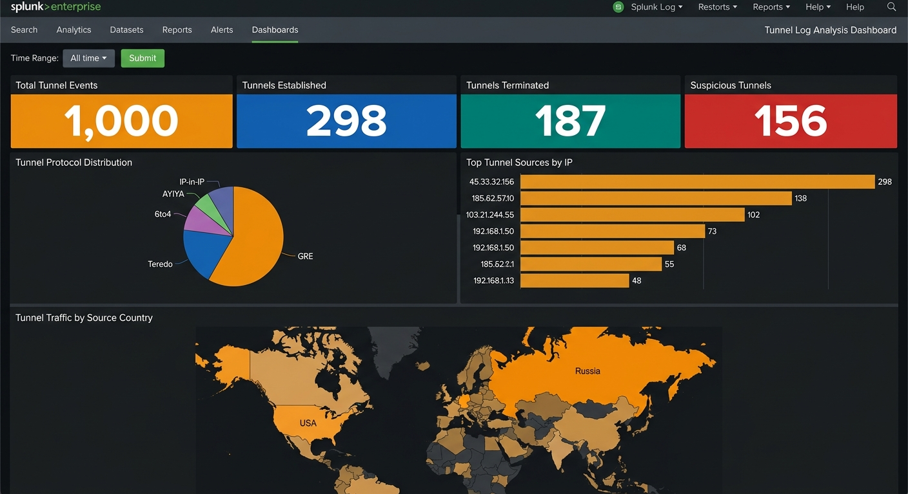

<div align="center">


</div>

> **Project Type:** SOC Analyst Lab — SIEM Dashboard Building  
> **Platform:** Splunk Enterprise / Splunk Cloud  
> **Data Source:** `tunnel_logs.json` (1,000 events)  
> **Skill Level:** Intermediate

## 📸 Completed Dashboard




## 📋 Table of Contents

| #   | Section                                              | Status |
| --- | ---------------------------------------------------- | ------ |
| 0   | [Lab Setup & Prerequisites](#lab-setup--prerequisites) | ⬜      |
| 1   | [Task 1 — Tunnel Overview Panels](#task-1--tunnel-overview-panels) | ⬜      |
| 2   | [Task 2 — Tunnel Patterns](#task-2--tunnel-patterns) | ⬜      |
| 3   | [Task 3 — Geo-Location Analysis](#task-3--geo-location-analysis) | ⬜      |
| 4   | [Final Dashboard Layout](#final-dashboard-layout)    | ⬜      |


## Lab Setup & Prerequisites

### What You Need

| Requirement            | Details                                                                 |
| ---------------------- | ----------------------------------------------------------------------- |
| **Splunk Instance**    | Splunk Enterprise (local) or Splunk Cloud (free trial works)            |
| **Data File**          | `tunnel_logs.json` → host `TunnelSensor` (1,000 tunnel events)         |
| **Sourcetype**         | `_json` for JSON logs                                                   |
| **Key Fields**         | `tunnel_type`, `action`, `id.orig_h`, `orig_bytes`, `classification`   |

### What Are Network Tunnels?

Network tunnels encapsulate one protocol inside another to transport data across incompatible networks. Common tunnel types:

| Protocol | Purpose | Security Risk |
|----------|---------|---------------|
| **GRE** | Generic Routing Encapsulation — connects remote networks | Can bypass firewall rules |
| **Teredo** | IPv6 over IPv4 tunneling | Often used to evade IPv4-only security controls |
| **6to4** | IPv6 transition mechanism | Can create unmonitored network paths |
| **AYIYA** | Anything-In-Anything tunneling | High data exfiltration risk |
| **IP-in-IP** | IP encapsulation | Can hide malicious traffic inside legitimate packets |

> ⚠️ **Why Tunnel Monitoring Matters:** Attackers use tunneling to bypass firewalls, exfiltrate data, and establish covert C2 channels. Any unexpected tunnel from an external IP is a high-priority alert.

### Data Ingestion

1. **Upload `tunnel_logs.json`**
   - Settings → Add Data → Upload → select `tunnel_logs.json`
   - Set **Host** = `TunnelSensor`, **Sourcetype** = `_json`
   - Review & Submit

2. **Verify ingestion:**
   ```spl
   source="tunnel_logs.json" host="TunnelSensor" | head 10
   ```

### Create the Dashboard

1. Go to **Dashboards** → **Create New Dashboard**
2. Name it **Tunnel Log Analysis Dashboard**
3. Select **Classic Dashboard** (Simple XML) → **Absolute** layout → **Create**


##  Task 1 — Tunnel Overview Panels

**Goal:** High-level tunnel activity metrics — total events, tunnels established, tunnels terminated, and suspicious tunnel count.

> 🎯 All four panels are **Single Value** visualizations.

---

### Panel 1.1 — Total Tunnel Events

**SPL Query:**

```spl
source="tunnel_logs.json" host="TunnelSensor" sourcetype="_json"
| stats count AS "Total Tunnel Events"
```

**What this does:** Baseline count of all tunnel-related network events detected by the sensor.

---

### Panel 1.2 — Tunnels Established

**SPL Query:**

```spl
source="tunnel_logs.json" host="TunnelSensor" sourcetype="_json" action="tunnel_established"
| stats count AS "Tunnels Established"
```

**What this does:** Counts new tunnel sessions. Each established tunnel represents a new encapsulation channel that could be legitimate (VPN, site-to-site) or malicious (C2, data exfiltration).

---

### Panel 1.3 — Tunnels Terminated

**SPL Query:**

```spl
source="tunnel_logs.json" host="TunnelSensor" sourcetype="_json" action="tunnel_terminated"
| stats count AS "Tunnels Terminated"
```

**What this does:** Counts closed tunnel sessions. Compare with established count — a large gap (many established, few terminated) indicates long-lived tunnels that may be persistent backdoors.

> 🔍 **SOC Analyst Tip:** Established ≫ Terminated = possible persistent C2 channel. Investigate the source IPs of long-lived tunnels immediately.

---

### Panel 1.4 — Suspicious Tunnels

**SPL Query:**

```spl
source="tunnel_logs.json" host="TunnelSensor" sourcetype="_json" classification="Suspicious"
| stats count AS "Suspicious Tunnels"
```

**What this does:** Counts tunnel events classified as suspicious — external IPs establishing new tunnels into internal infrastructure.

---

### ✅ Task 1 Result

| Total Tunnel Events | Tunnels Established | Tunnels Terminated | Suspicious Tunnels |
|----|----|----|-----|


##  Task 2 — Tunnel Patterns

**Goal:** Analyze tunnel protocol distribution and identify top tunnel sources — essential for detecting unauthorized VPNs and covert channels.

---

### Panel 2.1 — Tunnel Protocol Distribution (Pie Chart)

**SPL Query:**

```spl
source="tunnel_logs.json" host="TunnelSensor" sourcetype="_json"
| stats count by tunnel_type
```

**What this does:** Shows which tunnel protocols are in use. Expected patterns depend on your network:
- **GRE** dominant → typical for site-to-site VPNs
- **Teredo/6to4** present → IPv6 transition tunnels (often unmonitored)
- **AYIYA** appearing → unusual — high-risk tunneling protocol

> 🔍 **SOC Analyst Tip:** If your organization doesn't use IPv6, Teredo and 6to4 tunnels should not exist. Their presence indicates either misconfiguration or an attacker using IPv6 tunnels to bypass IPv4-only security controls.

---

### Panel 2.2 — Top Tunnel Sources by IP (Bar Chart)

**SPL Query:**

```spl
source="tunnel_logs.json" host="TunnelSensor" sourcetype="_json"
| top limit=10 id.orig_h
```

**What this does:** Ranks source IPs by tunnel event volume. External IPs generating high tunnel traffic are the top investigation priority.

> 🔍 **SOC Analyst Tip:** Cross-reference top external tunnel sources with:
> 1. Is this IP a known VPN gateway? → Expected
> 2. Is this IP a partner organization? → Verify with business
> 3. Unknown external IP? → **Immediate investigation required**

---

### ✅ Task 2 Result

| Tunnel Protocol Distribution (Pie Chart) | Top Tunnel Sources (Bar Chart) |
|---|---|


##  Task 3 — Geo-Location Analysis

**Goal:** Map tunnel traffic origins on a world map to identify connections from unexpected geographic regions.

---

### Panel 3.1 — Tunnel Traffic by Source Country (Choropleth Map)

**SPL Query:**

```spl
source="tunnel_logs.json" host="TunnelSensor" sourcetype="_json"
| table id.orig_h
| iplocation id.orig_h
| stats count by Country
| geom geo_countries featureIdField="Country"
```

**SPL Breakdown:**

| Line | Command | Purpose |
|------|---------|---------|
| 1 | `source=...` | Select all tunnel events |
| 2 | `\| table id.orig_h` | Extract source IPs |
| 3 | `\| iplocation id.orig_h` | Resolve IPs to countries using MaxMind GeoIP |
| 4 | `\| stats count by Country` | Aggregate tunnel events by country |
| 5 | `\| geom geo_countries...` | Render choropleth map |

**What this does:** World heatmap showing where tunnel traffic originates. Tunnels from countries where your organization has no presence are immediate red flags — especially if they're establishing new tunnels into your internal network.

> ⚠️ **Prerequisites:**
> - Splunk's `iplocation` command requires MaxMind GeoIP (ships with Splunk Enterprise)
> - Internal/RFC1918 IPs won't resolve to geographic locations

---

### ✅ Task 3 Result

> Full-width choropleth map showing tunnel traffic origins by country.


## 🏁 Final Dashboard Layout

| Row | Panels | Visualization Type |
|-----|--------|-------------------|
| **Input Bar** | Time Range + Submit | Input controls |
| **Row 1** | Total Events · Established · Terminated · Suspicious | 4× Single Value |
| **Row 2** | Protocol Distribution · Top Sources | Pie Chart + Bar Chart |
| **Row 3** | Tunnel Traffic by Source Country | Choropleth Map (full width) |

---

##  Complete Simple XML Reference

The full dashboard XML is available at [`xml/tunnel_dashboard.xml`](xml/tunnel_dashboard.xml). Import via **Dashboards** → **Create** → **Edit** → **Source** → Paste → **Save** ✅


## 🔑 Key Takeaways for SOC Analysts

| Concept | What You Practiced |
|---------|-------------------|
| **Tunnel Monitoring** | Building dashboards for encapsulated traffic visibility |
| **Covert Channel Detection** | Identifying unauthorized tunnels used for data exfiltration or C2 |
| **Protocol Analysis** | Understanding GRE, Teredo, 6to4, AYIYA tunnel types and their risks |
| **Persistence Detection** | Comparing established vs terminated tunnels to find persistent backdoors |
| **SPL Commands** | `stats count`, `top`, `table`, `iplocation`, `geom` |

---

## 📂 Project Structure

```
splunk-soc-project/
├── TUNNEL_LOG_ANALYSIS.md             ← This file
├── data/
│   └── tunnel_logs.json               ← Tunnel traffic data (1,000 events)
└── xml/
    └── tunnel_dashboard.xml            ← Importable Splunk XML
```


<div align="center">


</div>

<div align="center">

[](README.md)

</div>


